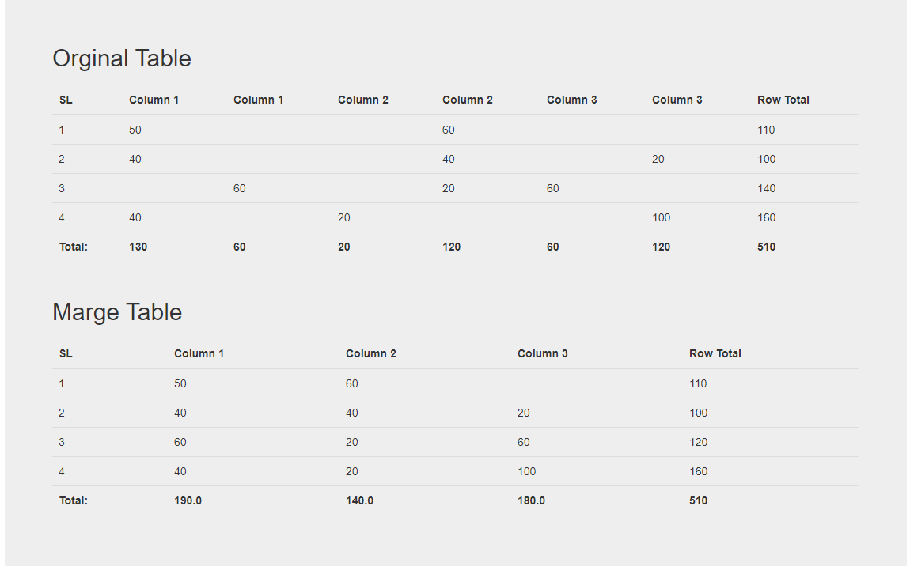

# column-merge
Code: 

```
$(function(){
    margecolumn("#tbl1");
});
    function margecolumn(table_element) {
            var i = 1;
            var header_name = '';
            var lengths = $(table_element+' thead tr:first-child th').length;
            for (i = 0; i < lengths; i++) {
                var e = $(table_element+' thead tr:first-child th')[i];
                if ($(e).text() === "Row Toal") { // last column
                    break;
                }
                else {
                    if (header_name === $(e).text()) {
                        removecol(i, table_element);
                    }
                    else {
                        header_name = $(e).text();
                    }
                    console.log($(e).text());
                }
            }
        }
        function removecol(c_colm,table_element) {
            p_colm = c_colm - 1;
            $(table_element + " thead tr").find("th:eq(" + c_colm + ")").remove();

            $(table_element+" tbody tr").each(function() {
                var c_text = $(this).find("td:eq("+c_colm+")").text();
                var p_text = $(this).find("td:eq(" + p_colm + ")").text();
                $(this).find("td:eq(" + p_colm + ")").text(c_text + p_text);
                $(this).find("td:eq("+c_colm+")").remove();
            });

            $(table_element+" tfoot tr").each(function() {
                var c_text = $(this).find("th:eq("+c_colm+")").text();
                var p_text = $(this).find("th:eq(" + p_colm + ")").text();
                var total = parseFloat(c_text) + parseFloat(p_text);

                $(this).find("th:eq(" + p_colm + ")").text(total.toFixed(1));
                $(this).find("th:eq("+c_colm+")").remove();
            });
            margecolumn(table_element);
        }
```

link: https://akhtaruzzaman.github.io/column-merge/columnmarge.html

Output:

